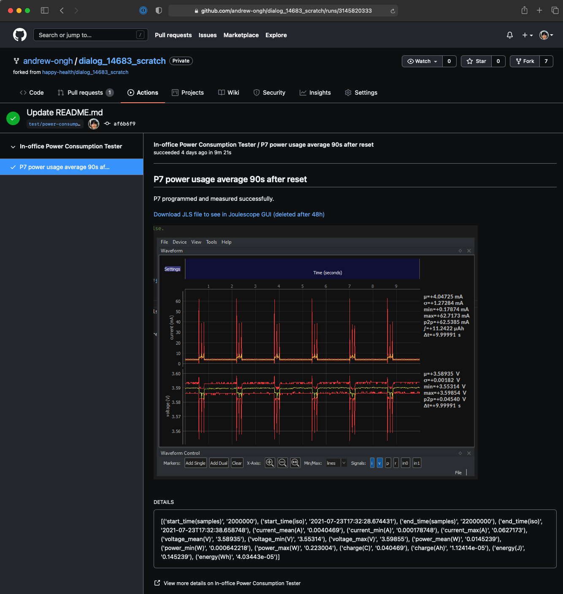
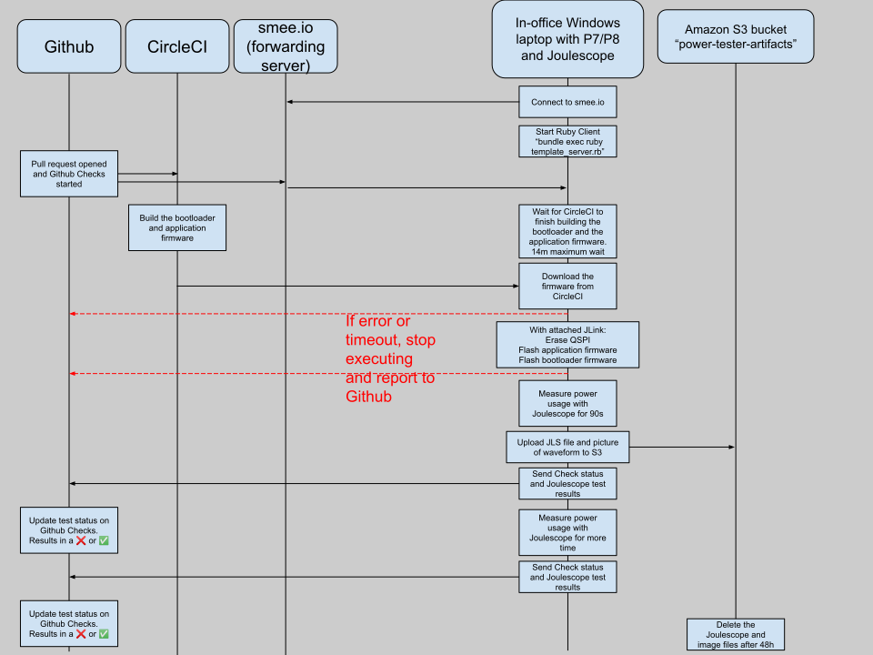
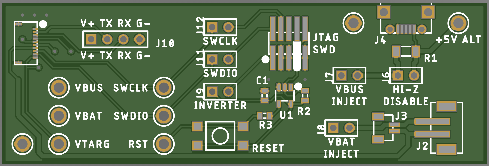
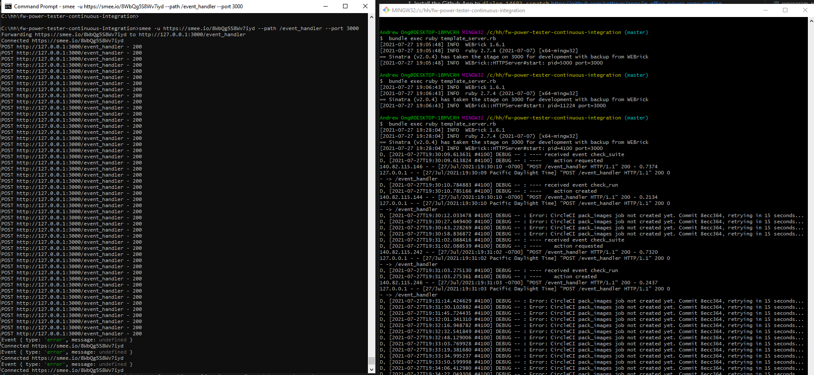

# Physical power consumption tester meant to run as continuous integration. 

Measures power consumption of P7/P8 attached to Windows laptop




Runs as a "Github app" alongside the CircleCI Github App 

Only triggers on repositories named "dialog_14683_scratch" 

Secrets (i.e. API keys) must be added in ".env" file. Example provided in ".env-example"

Needs to run on Windows because the script to flash the P7 is "initial_flash.bat". Path to dialog_14683_scratch repository must be specified in `reprogram_p7.sh`

High level overview of program flow: 



Created from Github App Template: 
You can use this GitHub App template code as a foundation to create any GitHub App you'd like. You can learn how to configure a template GitHub App by following the "[Setting up your development environment](https://developer.github.com/apps/quickstart-guides/setting-up-your-development-environment/)" quickstart guide on developer.github.com.


## Equipment Required:
1. Segger J-Link that's not an EDU (the EDU has an annoying daily EULA prompt)
2. (P7 or P8) with tail 
3. DC power supply set to 3.7V  
4. Joulescope
5. Ring breakout for its low power consumption: 


Power overhead: 
- The Segger JLink consumes 25μA
- The SN74LVC1G14 consumes 10μA

## Install
1. Install the Github App to `dialog_14683_scratch`  https://github.com/settings/apps/in-office-power-consumption-tester/installations 
1. Install Ruby on Windows: https://github.com/oneclick/rubyinstaller2/releases/download/RubyInstaller-2.7.4-1/rubyinstaller-devkit-2.7.4-1-x64.exe
2. In the MINGW32 shell:
```
gem install bundler
```

```
Successfully installed bundler-2.2.23
Parsing documentation for bundler-2.2.23
Installing ri documentation for bundler-2.2.23
Done installing documentation for bundler after 7 seconds
1 gem installed
```

3. To run the code, make sure you have [Bundler](http://gembundler.com/) installed; then enter `bundle install` on the command line.

4. Install Node
5. `npm install --global smee-client`
6. `cd pyjoulescope`
7. `python -m ensurepip`
8. `pip3 install -U -r requirements.txt`
9. Put a shortcut to Joulescope in Startup folder (or else `cannot open gdb interface` on reboot)
9. Edit template_server.rb to have to correct paths for `DIALOG_WORKSPACE` and `DIALOG_WORKSPACE_WITH_ALT_DRIVE_LETTER`
10. Manually create these folders or else the script will error
```
"${DIALOG_WORKSPACE}/projects/dk_apps/templates/freertos_retarget/Happy_P7_QSPI_Release/"
"${DIALOG_WORKSPACE}/sdk/bsp/system/loaders/ble_suota_loader/DA14683-00-Release_QSPI/"
```
11. Edit the permissions in those folders to include write for all users


## Set environment variables

1. Create a copy of the `.env-example` file called `.env`.
2. Change the "Dialog workspace" directory in `reprogram_p7.sh`
3. Add your GitHub App's private key, app ID, and webhook secret and the CircleCI API key and the key of an AWS IAM user that has access to S3 to the `.env` file.

## Run the server

1. Click "start-smee-and-server.bat". Two windows should appear. One for the smee-client and one for the Sinatra Ruby Server. This file can be used to restart the server too. 
3. View the default Sinatra app at `localhost:3000`. It should say `Sinatra doesn’t know this ditty.`

The command-line windows should look like this: 



## Troubleshooting 

1. Ctrl-C both command-line windows, 
2. Kill all Ruby instances by opening a third Windows command-line window and: `taskkill /f /im ruby.exe`  
3.  restart both commands
- All the calls to and from the Github API from this application are logged here and can be re-sent: https://github.com/settings/apps/in-office-power-consumption-tester/advanced 